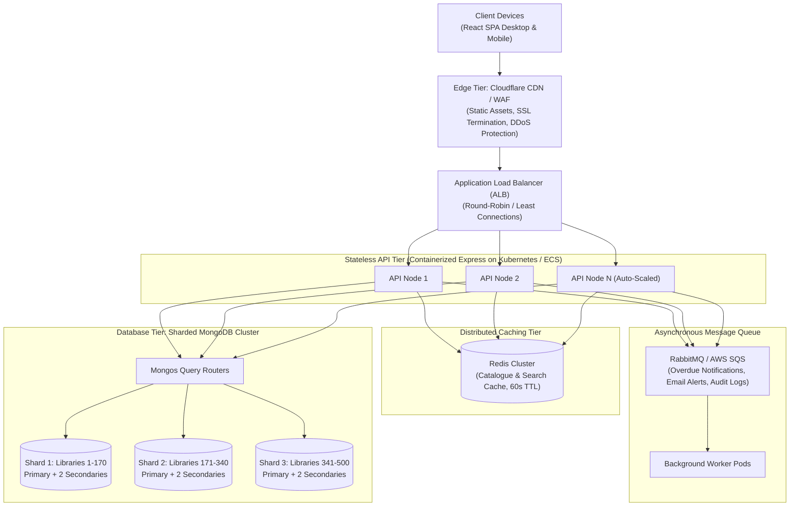

# ShelfLife — IA-II Full Stack Web Development
## Comprehensive Examination Answers & System Design Documentation

* **Course:** Full Stack Web Development (IA-II)
* **Duration:** 3 Hours | **Max Marks:** 50
* **Student Name:** __________________________________
* **Roll No.:** ________________________________________
* **Date:** October 5, 2026
* **Application:** **ShelfLife — College Library Management System**
* **Live Backend:** `https://shelflife-ia-ii-backend.onrender.com`
* **Live Frontend:** `https://shelf-life-ia-ii.vercel.app`

---

# Marks Distribution Summary

| Section | Topic | Marks |
| :--- | :--- | :---: |
| **Section A** | Backend Development (Node.js, Express.js & MongoDB) | **20** |
| **Section B** | Frontend Development (React with TypeScript) | **20** |
| **Section C** | System Design (Scaling to 500 Campus Libraries & 2M Members) | **10** |
| **Total** | | **50** |

---

# Section A — Backend Development (Node.js, Express.js, MongoDB) [20 Marks]

---

### Q1.a) Mongoose Schemas Design (Entities, Validation, References)

The system models three core entities in MongoDB using Mongoose v8.

#### 1. Book Schema (`backend/src/models/Book.js`)
* **Attributes:** `title`, `author`, `isbn`, `genre`, `totalCopies`, `availableCopies`
* **Constraints:** `isbn` is unique and trimmed. `totalCopies` and `availableCopies` enforce non-negative values (`min: 0`). Timestamps (`createdAt`, `updatedAt`) are automatically tracked.

```javascript
import mongoose from 'mongoose';

const bookSchema = new mongoose.Schema({
  title: { type: String, required: true, trim: true },
  author: { type: String, required: true, trim: true },
  isbn: { type: String, required: true, unique: true, trim: true },
  genre: { type: String, required: true, trim: true },
  totalCopies: { type: Number, required: true, min: 0 },
  availableCopies: { type: Number, required: true, min: 0 }
}, { timestamps: true });

export default mongoose.model('Book', bookSchema);
```

#### 2. Member Schema (`backend/src/models/Member.js`)
* **Attributes:** `name`, `email`, `membershipId`, `joinedDate`
* **Constraints:** `email` is lowercase, trimmed, and strictly unique. `membershipId` is strictly unique. `joinedDate` defaults to `Date.now`.

```javascript
import mongoose from 'mongoose';

const memberSchema = new mongoose.Schema({
  name: { type: String, required: true, trim: true },
  email: { type: String, required: true, unique: true, lowercase: true, trim: true },
  membershipId: { type: String, required: true, unique: true, trim: true },
  joinedDate: { type: Date, default: Date.now }
}, { timestamps: true });

export default mongoose.model('Member', memberSchema);
```

#### 3. BorrowRecord Schema (`backend/src/models/BorrowRecord.js`)
* **Attributes:** `book` (ObjectId reference), `member` (ObjectId reference), `issueDate`, `dueDate`, `returnDate`, `status`
* **References & Enums:** Refers directly to `'Book'` and `'Member'` models. Status is constrained to `['issued', 'returned', 'overdue']` with default `'issued'`.

```javascript
import mongoose from 'mongoose';

const borrowRecordSchema = new mongoose.Schema({
  book: { type: mongoose.Schema.Types.ObjectId, ref: 'Book', required: true },
  member: { type: mongoose.Schema.Types.ObjectId, ref: 'Member', required: true },
  issueDate: { type: Date, default: Date.now },
  dueDate: { type: Date, required: true },
  returnDate: { type: Date, default: null },
  status: { type: String, enum: ['issued', 'returned', 'overdue'], default: 'issued' }
}, { timestamps: true });

export default mongoose.model('BorrowRecord', borrowRecordSchema);
```

---

### Q1.b) RESTful Endpoints Implementation

#### 1. `POST /api/books` — Add a new book
* Validates required fields and copy counts (`availableCopies <= totalCopies`). Returns `201 Created`.
```javascript
export async function createBook(req, res) {
  const book = await Book.create(req.body);
  res.status(201).json({ success: true, data: book });
}
```

#### 2. `GET /api/books` — List, search, filter, and paginate books
* Supports `page` (default 1), `limit` (default 10, capped at 100), case-insensitive regex `search` by title, and exact case-insensitive regex `genre` filtering.
```javascript
export async function getBooks(req, res) {
  const page = Math.max(parseInt(req.query.page, 10) || 1, 1);
  const limit = Math.min(Math.max(parseInt(req.query.limit, 10) || 10, 1), 100);
  const filter = {};
  if (req.query.genre) filter.genre = new RegExp(`^${escapeRegex(req.query.genre)}$`, 'i');
  if (req.query.search) filter.title = new RegExp(escapeRegex(req.query.search), 'i');

  const [books, total] = await Promise.all([
    Book.find(filter).sort({ title: 1 }).skip((page - 1) * limit).limit(limit),
    Book.countDocuments(filter)
  ]);

  res.json({
    success: true,
    data: books,
    pagination: { page, limit, total, totalPages: Math.ceil(total / limit) }
  });
}
```

#### 3. `POST /api/members` — Register a new member
* Validates `name`, `email`, and `membershipId`. Verifies email format via regex. Returns `201 Created`.
```javascript
export async function createMember(req, res) {
  const member = await Member.create(req.body);
  res.status(201).json({ success: true, data: member });
}
```

#### 4. `POST /api/borrow` — Issue a book (Protected by JWT)
* Checks member existence, enforces future `dueDate` (defaults to 14 days), atomically decrements `availableCopies` only if `> 0`, and creates a `BorrowRecord`.
```javascript
export async function issueBook(req, res) {
  const { bookId, memberId } = req.body;
  const dueDate = req.body.dueDate ? new Date(req.body.dueDate) : new Date(Date.now() + 14 * 86400000);
  if (Number.isNaN(dueDate.getTime()) || dueDate <= new Date()) {
    return res.status(400).json({ success: false, message: 'dueDate must be a valid future date' });
  }

  const member = await Member.findById(memberId);
  if (!member) return res.status(404).json({ success: false, message: 'Member not found' });

  // Atomic conditional decrement prevents race condition
  const book = await Book.findOneAndUpdate(
    { _id: bookId, availableCopies: { $gt: 0 } },
    { $inc: { availableCopies: -1 } },
    { new: true }
  );
  if (!book) return res.status(409).json({ success: false, message: 'Book not found or no copies are available' });

  try {
    const record = await BorrowRecord.create({ book: book._id, member: member._id, dueDate });
    res.status(201).json({ success: true, message: 'Book issued successfully', data: record });
  } catch (error) {
    await Book.findByIdAndUpdate(bookId, { $inc: { availableCopies: 1 } });
    throw error;
  }
}
```

#### 5. `POST /api/return/:borrowId` — Return a book (Protected by JWT)
* Atomically checks `returnDate: null` to prevent double-returns, sets `returnDate`, changes status to `'returned'`, and increments `availableCopies` by 1.
```javascript
export async function returnBook(req, res) {
  const record = await BorrowRecord.findOneAndUpdate(
    { _id: req.params.borrowId, returnDate: null },
    { $set: { returnDate: new Date(), status: 'returned' } },
    { new: true }
  );

  if (!record) {
    const existing = await BorrowRecord.findById(req.params.borrowId);
    if (!existing) return res.status(404).json({ success: false, message: 'Borrow record not found' });
    return res.status(409).json({ success: false, message: 'This book has already been returned' });
  }

  await Book.findByIdAndUpdate(record.book, { $inc: { availableCopies: 1 } });
  res.json({ success: true, message: 'Book returned successfully', data: record });
}
```

#### 6. `GET /api/members/:id/history` — Member full borrow history
* Dynamically updates overdue status in database for expired unreturned records (`dueDate < now`), populates full Book and Member references, and returns sorted by `issueDate: -1`.
```javascript
export async function getMemberHistory(req, res) {
  const member = await Member.findById(req.params.id);
  if (!member) return res.status(404).json({ success: false, message: 'Member not found' });

  const now = new Date();
  await BorrowRecord.updateMany(
    { member: member._id, returnDate: null, dueDate: { $lt: now }, status: 'issued' },
    { status: 'overdue' }
  );

  const records = await BorrowRecord.find({ member: member._id })
    .populate('book', 'title author isbn genre')
    .populate('member', 'name email membershipId')
    .sort({ issueDate: -1 });

  res.json({ success: true, data: { member, history: records } });
}
```

---

### Q1.c) Middleware Architecture

1. **Centralized Error Handling (`backend/src/middleware/errorHandler.js`):**
   * Catches 404s for undefined routes.
   * Handles MongoDB duplicate key errors (`code: 11000`) and returns `409 Conflict`.
   * Handles Mongoose `ValidationError` and returns `400 Bad Request`.
   * Fallback returns `500 Internal Server Error`.

2. **Request Logging (`backend/src/middleware/logger.js`):**
   * Custom middleware tracking HTTP Method, URL, Status Code, and Execution Duration in milliseconds (`res.on('finish')`).

3. **Input Validation (`backend/src/middleware/validate.js`):**
   * `requireFields(fields)`: Checks that all mandatory body keys are present and not empty.
   * `validateBook`: Ensures `totalCopies` and `availableCopies` are non-negative integers and `availableCopies <= totalCopies`.
   * `validateEmail`: Enforces RFC-compliant email structure (`/^\S+@\S+\.\S+$/`).

---

### Q1.d) Authentication & Authorization Layer

1. **Login Route (`POST /api/auth/login`):**
   * Verifies librarian credentials (`librarian@shelflife.com` / `librarian123`) using `bcrypt.compare`.
   * Issues a signed JSON Web Token (JWT) with an 8-hour expiry containing `{ email, role: 'librarian' }`.

2. **JWT Authentication Middleware (`backend/src/middleware/auth.js`):**
   * Extracts token from `Authorization: Bearer <token>` header.
   * Verifies the token using `jwt.verify(token, process.env.JWT_SECRET)`.
   * Attaches decoded payload to `req.user`.
   * Rejects missing or invalid tokens with `401 Unauthorized`.
   * Applied strictly to protect `POST /api/borrow` and `POST /api/return/:borrowId`.

---

### Q1.e) Race Condition Prevention (The Concurrency Guarantee)

> **Explanation of Concurrency Defense:**  
> When two librarians issue the final physical copy of a book (`availableCopies = 1`) simultaneously, ShelfLife prevents negative inventory using MongoDB's single-document atomic update:  
> `Book.findOneAndUpdate({ _id: bookId, availableCopies: { $gt: 0 } }, { $inc: { availableCopies: -1 } }, { new: true })`.  
> Under MongoDB WiredTiger's document-level locking, Request 1 acquires the lock, matches the condition (`1 > 0`), and decrements copies to `0`. When Request 2 acquires the lock, the condition (`0 > 0`) evaluates to `false`, matching zero documents and returning `null`. The backend halts Request 2 and returns `409 Conflict`, guaranteeing that inventory never drops below zero and exactly one loan is recorded.

---

# Section B — Frontend Development (React with TypeScript) [20 Marks]

---

### Q2.a) TypeScript Models and Centralized API Client

#### Domain Interfaces (`frontend/src/types/index.ts`)
```typescript
export type BorrowStatus = 'issued' | 'returned' | 'overdue';
export type ObjectId = string;

export interface Book {
  _id: ObjectId;
  title: string;
  author: string;
  isbn: string;
  genre: string;
  totalCopies: number;
  availableCopies: number;
}

export interface Member {
  _id: ObjectId;
  name: string;
  email: string;
  membershipId: string;
  joinedDate: string;
}

export interface BorrowRecord {
  _id: ObjectId;
  book: Book | ObjectId;
  member: Member | ObjectId;
  issueDate: string;
  dueDate: string;
  returnDate: string | null;
  status: BorrowStatus;
}

export interface PaginatedResponse<T> {
  success: boolean;
  data: T[];
  pagination: { page: number; limit: number; total: number; totalPages: number };
}
```

#### Centralized Axios Client (`frontend/src/api/client.ts`)
* Intercepts outgoing requests to automatically attach `Authorization: Bearer <token>`.
* Intercepts responses to catch `401 Unauthorized`, automatically purging `localStorage` and redirecting unauthenticated users to `/login`.

---

### Q2.b) Book List Page (`frontend/src/pages/Books.tsx`)
* **Features:**
  * Displays catalogue volumes using `<DataTable<Book>>`.
  * **250ms Debounced Title Search:** Prevents spamming the database on every keystroke.
  * **Genre Selector Dropdown:** Filters across 11 genres.
  * **Inventory Progress Bar:** Visually indicates stock ratio with dynamic colored badges (`AVAILABLE`, `LOW STOCK`, `OUT OF STOCK`).
  * **Loading & Error States:** Renders pulsing `LoadingSkeleton` during fetch, `EmptyState` when queries yield no results, and `Alert` with retry button on failure.

---

### Q2.c) Issue Book Form (`frontend/src/pages/IssueBook.tsx`)
* **Features:**
  * Member dropdown populated from `GET /api/members`.
  * Book dropdown dynamically filtered to only titles with `availableCopies > 0`.
  * Date picker with `min` set to today's date (defaults to 14 days).
  * **In-Flight Submit Handling:** Button text changes to `"Issuing..."` and the button is disabled during submission to prevent duplicate requests.
  * Instant feedback with green success banners and red error alerts.

---

### Q2.d) Member History Page (`frontend/src/pages/MemberHistory.tsx`)
* **Features:**
  * Detailed Member Information Card displaying name, email, avatar, membership ID, and join date.
  * Complete circulation history rendered via `<DataTable<BorrowRecord>>`.
  * **Visually Distinct Overdue Badge:** Evaluates `!record.returnDate && new Date(record.dueDate) < today` and renders an animated red `OVERDUE` badge.
  * **Return Book Action Dialog:** Added a "Return" button on active loans triggering a confirmation dialog that calls `POST /api/return/:borrowId`, restoring inventory and refreshing the table.

---

### Q2.e) Reusable Generic Component (`frontend/src/components/DataTable.tsx`)
* Implemented as a strongly typed generic component `<DataTable<T extends { _id: string }>>`:
* Reused across **three distinct entities**:
  1. `<DataTable<Book>>` in `Books.tsx`
  2. `<DataTable<Member>>` in `Members.tsx`
  3. `<DataTable<BorrowRecord>>` in `MemberHistory.tsx`

```tsx
export interface Column<T> {
  header: string;
  cell: (row: T) => React.ReactNode;
  className?: string;
}

interface DataTableProps<T extends { _id: string }> {
  columns: Column<T>[];
  rows: T[];
  emptyMessage?: string;
}

export default function DataTable<T extends { _id: string }>({
  columns,
  rows,
  emptyMessage = 'No records found.'
}: DataTableProps<T>) {
  return (
    <div className="rounded-xl border border-border bg-card/60 overflow-hidden">
      <Table>
        <TableHeader className="bg-muted/40">
          <TableRow>
            {columns.map((c) => (
              <TableHead key={c.header}>{c.header}</TableHead>
            ))}
          </TableRow>
        </TableHeader>
        <TableBody>
          {rows.length > 0 ? (
            rows.map((row) => (
              <TableRow key={row._id}>
                {columns.map((c) => (
                  <TableCell key={c.header}>{c.cell(row)}</TableCell>
                ))}
              </TableRow>
            ))
          ) : (
            <TableRow>
              <TableCell colSpan={columns.length} className="text-center py-8 text-muted-foreground">
                {emptyMessage}
              </TableCell>
            </TableRow>
          )}
        </TableBody>
      </Table>
    </div>
  );
}
```

---

### Q2.f) Client-Side Route Protection (`frontend/src/components/ProtectedRoute.tsx`)
* Inspects `localStorage.getItem('shelflife_token')`.
* Unauthenticated visits to `/dashboard`, `/books`, `/issue`, or `/members` are immediately redirected to `/login` via React Router's `<Navigate to="/login" replace />`.

---

### Q2 Deliverable Note: State Management Choice
> **State Management Rationale:**  
> ShelfLife deliberately uses **React Local State (`useState` & `useEffect`)** combined with **Axios Interceptors** rather than Redux, Zustand, or MobX.  
> 1. **Data Freshness:** Library circulation requires real-time, authoritative data from the database (e.g. available copy counts and overdue statuses change dynamically on the server). Local state ensures each view fetches fresh data on navigation rather than holding stale global cache.  
> 2. **Minimal Shared State:** The only piece of state truly shared across the entire application is the JWT authentication token, which is stored in `localStorage` and managed by the router and Axios interceptor.  
> 3. **Reduced Overhead:** Avoids boilerplate actions, reducers, and store providers for a clean, maintainable, and high-performance SPA.

---

# Section C — System Design (Scale to 500 Libraries & 2M Members) [10 Marks]

---

### Q3.a) High-Level Architecture Diagram & Component Roles



#### Component Responsibilities:
1. **Edge CDN & WAF:** Caches the Vite React bundle globally; terminates TLS; mitigates Layer 7 DDoS attacks.
2. **Load Balancer (ALB):** Distributes incoming API traffic across stateless Express.js pods. Session affinity is unnecessary because JWT authentication is stateless.
3. **Stateless API Cluster:** Horizontal Pod Autoscaler (HPA) scales Node.js instances dynamically based on CPU and request latency.
4. **Redis Cache:** In-memory caching for catalogue listings and title searches, offloading 90% of read traffic from MongoDB.
5. **Message Queue & Workers:** Decouples long-running asynchronous tasks (sending overdue emails, nightly fine calculations, analytics aggregation) from the synchronous HTTP request path.
6. **Sharded MongoDB Cluster:** Provides horizontal write and storage scaling with replica sets for 99.99% high availability.

---

### Q3.b) MongoDB Sharding Strategy & Shard Keys

For 500 campus libraries and 2 million members, a **multi-tenant sharded architecture** is required.

#### 1. `Book` Collection Shard Key: `{ libraryId: 1, _id: 1 }`
* **Justification:**  
  Students and librarians browse the catalogue of their specific campus library. Placing `libraryId` as the prefix routes 99% of catalogue queries directly to a single shard (targeted query) rather than broadcasting to all shards (scatter-gather). The `_id` suffix guarantees unique chunk boundaries and even data distribution.

#### 2. `BorrowRecord` Collection Shard Key: `{ libraryId: 1, member: 1, issueDate: -1 }`
* **Justification:**  
  Loan operations and member history queries are strictly scoped to a campus library and a member. This compound key provides range locality for member borrowing history queries, while distributing high-volume loan writes evenly across the 500-library cluster.

---

### Q3.c) Read-Heavy Caching Strategy

#### Dominant Read Operation:
**Book Catalogue Listing & Title Search (`GET /api/books?search=...&genre=...&page=...`)** accounts for >85% of total system requests.

#### Redis Caching Implementation:
* **Cache Key Structure:**  
  `books:{libraryId}:{genre}:{normalizedSearch}:{page}:{limit}`  
  *(Example: `books:campus_04:Technology:clean:1:10`)*
* **Time-to-Live (TTL):**  
  **60 seconds.** A short TTL prevents stale inventory counts from lingering while drastically reducing database load.
* **Cache Invalidation Strategy:**
  * **Event-Driven Write Invalidation:** When a book is added or updated (`POST /api/books`), or when a loan is issued or returned (`POST /api/borrow`, `POST /api/return`), the API invalidates matching Redis keys using a pattern scan or increments a `catalogue_version:{libraryId}` namespace counter.

---

### Q3.d) Guaranteeing Non-Negative Available Copies under Concurrency

#### Chosen Mechanism:
**Single-Document Atomic Conditional Mutation in MongoDB**

```javascript
Book.findOneAndUpdate(
  { _id: bookId, libraryId: libraryId, availableCopies: { $gt: 0 } },
  { $inc: { availableCopies: -1 } },
  { new: true }
);
```

#### Why Chosen Over Alternatives:

| Mechanism | Evaluation & Trade-offs | Verdict |
| :--- | :--- | :--- |
| **Atomic DB Mutation (Chosen)** | Native WiredTiger document-level lock. Executed at the storage engine level with zero network round-trips. Guarantees `availableCopies` never drops below 0 across multiple API servers. | **Winner:** Lowest latency, highest throughput, no external dependencies. |
| **Optimistic Locking (`version` key)** | Uses a version field (`__v`). High concurrency causes frequent aborts and retry storms, degrading performance under heavy spikes. | **Rejected:** High CPU cost on retry storms. |
| **Distributed Locks (Redis Redlock)** | Requires acquiring and releasing locks across Redis nodes. Adds 10–30ms latency per borrow request and risks deadlocks or orphaned locks if a pod crashes. | **Rejected:** Adds unnecessary distributed system complexity. |
| **Database Transactions (ACID)** | Multi-document transactions across shards introduce cross-shard two-phase commit overhead. | **Secondary:** Only needed if multi-document consistency is strictly mandatory. |

---

### Q3.e) Handling 10× Semester Traffic Spikes Cost-Effectively

To handle the surge during the first week of every semester without paying for idle capacity year-round:

1. **Horizontal Pod Autoscaling (HPA):**  
   Configure Kubernetes HPA to autoscale stateless API pods from a baseline of **10 pods to 100 pods** based on CPU utilization (>70%) and HTTP request rate. Pods scale up in 30 seconds and scale back down after the rush.
2. **Aggressive Edge & Redis Caching:**  
   During peak week, increase Redis search TTL from 60 seconds to 120 seconds. This absorbs up to 95% of catalogue search queries, shielding MongoDB from the 10× read surge.
3. **Queue Decoupling:**  
   Circulation counter transactions only write the essential record. All non-essential actions (welcome emails, audit history logging, fine updates) are enqueued to RabbitMQ/SQS and processed asynchronously by background worker pods.
4. **Scheduled Cloud Capacity:**  
   Pre-schedule temporary vertical scaling for the primary database shards 48 hours before the semester start date using Cloud Automation (e.g. AWS Auto Scaling / MongoDB Atlas Auto-Scale), and scale down once enrollment week ends.

---
*End of IA-II Solutions & System Design Document*
