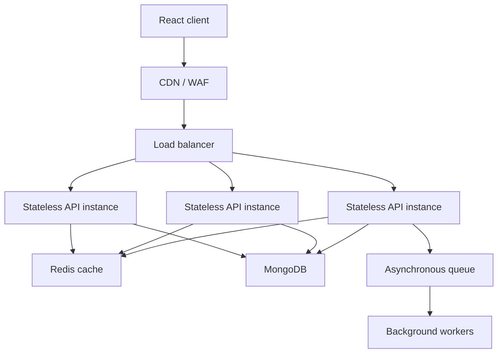

# ShelfLife System Design

ShelfLife is designed to grow from a single campus deployment to 500 campus libraries, about two million members, and 10× normal traffic during the first week of each semester.

## A. High-level architecture

The React client is served from a CDN, with a WAF handling common edge threats. A load balancer distributes requests across identical, stateless Node/Express API instances; JWTs mean session affinity is unnecessary. Redis provides low-latency cached reads. MongoDB remains the source of truth. A queue and workers handle non-interactive work such as due-date reminder emails, overdue notifications, audit exports, analytics aggregation and search-index updates.

## B. MongoDB scaling

Begin with a single managed MongoDB replica-set cluster, backed by indexes and read replicas as needed. This is operationally simpler and suitable until size or throughput demonstrates the need for sharding. At larger scale, shard collections deliberately:

- **Book:** `{ libraryId: 1, _id: 1 }` (or a hashed compound variant) keeps a library's catalogue access local while retaining distribution. Most catalogue queries should include `libraryId`.
- **BorrowRecord:** `{ libraryId: 1, member: 1, issueDate: -1 }` supports member-history reads within a library and distributes the 500-library workload. If one library becomes disproportionately hot, a hashed `member` suffix can improve distribution.

Every document should include `libraryId` in this multi-tenant design. The final shard key must be chosen from measured access patterns, query targeting, write distribution and cardinality; no proposed key should be adopted solely from a schema diagram.

## C. Read-heavy operation: book search/listing

Book search/listing is expected to be the dominant read operation. Cache its paged result in Redis using a key such as `books:{libraryId}:{genre}:{normalizedSearch}:{page}:{limit}`. Use a short 30–60 second TTL to keep availability fresh. Invalidate relevant library/search keys, or bump a per-library catalogue version included in the key, whenever a book is created/edited or inventory changes on issue/return. MongoDB indexes should support `libraryId`, genre and normalized title search.

## D. Concurrent issue-book

Use an atomic conditional update: match the book ID (and `libraryId`) plus `availableCopies > 0`, then apply `$inc: { availableCopies: -1 }`. MongoDB executes this document update atomically, so availability never becomes negative even if many librarians issue the last copy at once. It is preferable to application-level locks because it needs no lock lifecycle, works across API instances and relies on the database's concurrency guarantees. Where updating inventory and creating the BorrowRecord must be all-or-nothing, use a MongoDB transaction; the current app uses a compensating increment if record creation fails.

## E. Semester traffic at 10× normal volume

Scale API instances horizontally behind the load balancer and use autoscaling based on request rate, latency and CPU. Redis absorbs repeated catalogue reads, and background jobs are queued rather than performed in HTTP requests. Database capacity should be monitored and increased before the peak, with read replicas/sharding introduced based on observed bottlenecks. After the semester surge, scale down API and worker capacity instead of permanently provisioning for peak load.
